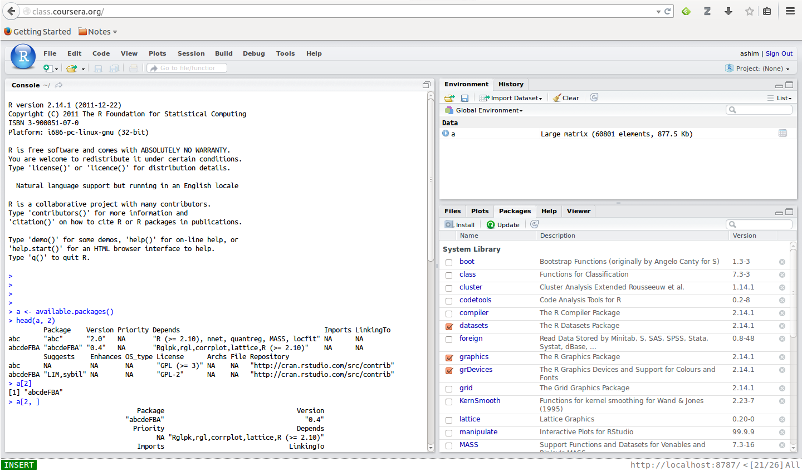
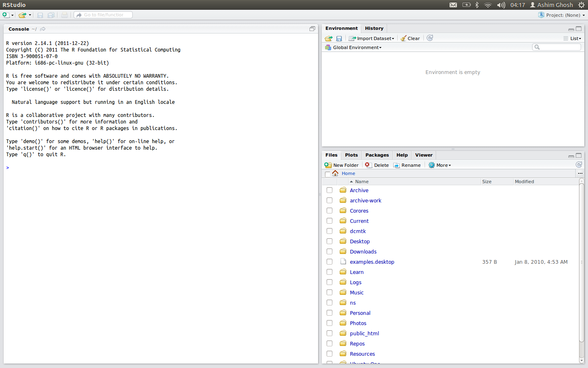

# Data Science Notes

## R Installation

Use the `r-base` package (Ubuntu)-

    sudo apt-get install r-base r-base-dev

Ubuntu 12.04 has version 2.14.1 of R, which is sufficient for RStudio.

## RStudio Installation

Get the source from GitHub, and not from the [RStudio website].

- Running `dependencies/linux/install-dependencies/debian` and
  `dependencies/common/install-common` takes care of the dependencies.

- Configure (create `build` folder)

      cmake .. -DRSTUDIO_TARGET=Desktop -DCMAKE_BUILD_TYPE=Release

- Install (in `build` folder)

      sudo make install

- Execution:

  - Server: Create the following directories for the server:

    - `mkdir -p /var/run/rstudio-server`
    - `mkdir -p /var/lock/rstudio-server`
    - `mkdir -p /var/log/rstudio-server`
    - `mkdir -p /var/lib/rstudio-server`

    The server is installed in `/usr/local/lib/rstudio-server/bin`.
    Run `rserver` to start the server.

    

 - Desktop: The Desktop version is installed in
   `/usr/local/lib/rstudio-server/bin`.  Run `rstudio` to start RStudio.
 
    

[Rstudio Website]: http://www.rstudio.com/products/rstudio/download/
